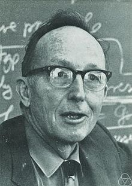
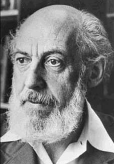

# Category theory

지금까지 함수형 프로그래밍의 기초인 **합성** 에 대해 살펴보았습니다.

> 문제를 어떻게 해결하나요? 우리는 큰 문제를 작은 문제로 분할합니다. 만약 작은 문제들이 여전히 크다면, 더 작게 분할합니다. 마지막으로, 작은 문제들을 해결하는 코드를 작성합니다. 그리고 여기서 프로그래밍의 정수가 등장합니다: 우리는 큰 문제를 해결하기 위해 작은 문제를 다시 합성합니다. 만약 조각을 다시 되돌릴 수 없다면 분할은 아무 의미도 없을 것입니다. - Bartosz Milewski

이 말은 정확히 무엇을 의미하는 걸까요? 어떻게 두 조각이 _합성_ 되는지 알 수 있을까요? 두 조각이 _잘_ 합성된다는 것은 어떤 의미일까요?

> 만약 결합된 엔티티를 변경하지 않고 각각의 행동을 쉽고 일반적으로 결합할 수 있다면 엔티티들은 합성가능하다고 말한다. 나는 재사용성과 프로그래밍 모델에서 간결하게 표현되는 조합적 확장을 달성하기 위한 이루기 위해 가장 중요한 요소가 합성가능성 이라고 생각한다. - Paul Chiusano

함수형 스타일로 작성된 프로그램이 파이프라인과 얼마나 유사한지 간략하게 언급하였습니다:

```typescript
const program = pipe(
  input,
  f1, // 순수 함수
  f2, // 순수 함수
  f3, // 순수 함수
  ...
)
```

하지만 이런 스타일로 코딩하는 것은 얼마나 간단한 걸까요? 한번 시도해봅시다:

```typescript
import { pipe } from 'fp-ts/function'
import * as RA from 'fp-ts/ReadonlyArray'

const double = (n: number): number => n * 2

/**
 * 프로그램은 주어진 ReadonlyArray<number> 의 첫 번째 요소를 두 배한 값을 반환합니다
 */
const program = (input: ReadonlyArray<number>): number =>
  pipe(
    input,
    RA.head, // 컴파일 에러! 타입 'Option<number>' 는 'number' 에 할당할 수 없습니다
    double
  )
```

왜 컴파일 에러가 발생할까요? 왜냐하면 `head` 와 `double` 을 합성할 수 없기 때문입니다.

```typescript
head: (as: ReadonlyArray<number>) => Option<number>
double: (n: number) => number
```

`head` 의 공역은 `double` 의 정의역에 포함되지 않습니다.

순수함수로 프로그램을 만드려는 우리의 시도는 끝난걸까요?

우리는 그러한 근본적인 질문에 답할 수 있는 **엄격한 이론** 을 찾아야 합니다.

우리는 합성가능성에 대한 **공식적인 정의** 가 필요합니다.

다행히도, 지난 70년 동안, 가장 오래되고 가장 큰 인류의 오픈 소스 프로젝트 (수학) 의 구성원과 많은 수의 연구원들이 합성가능성에 대한 다음 이론을 개발하는데 몰두했습니다.
**category theory**, Saunders Mac Lane along Samuel Eilenberg (1945) 에 의해 시작된 수학의 한 분야.

> category 는 합성의 본질이라 할 수 있습니다.





다음 장에서 어떻게 category 가 다음 기반을 구성할 수 있는지 살펴볼 것입니다:

- 일반적인 **프로그래밍 언어** 를 위한 모델
- **합성** 의 개념을 위한 모델
